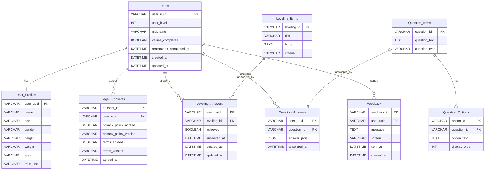
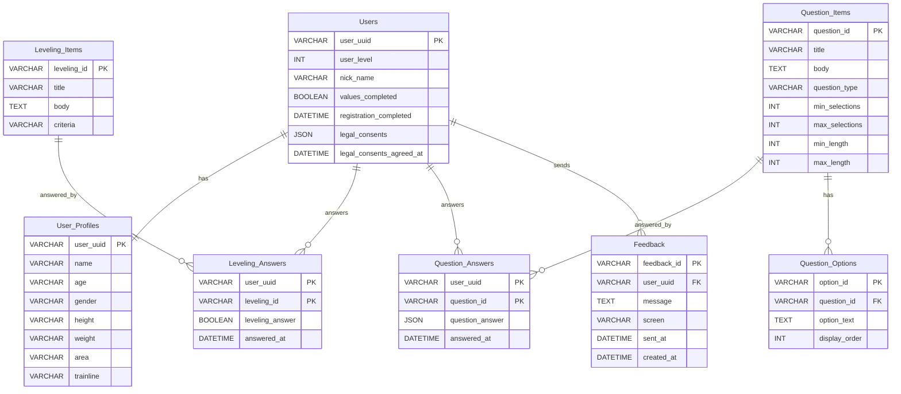

# Matcher Database Minimum Draft

`database_init.png` のテーブル構成を骨格にした、最小バックエンド向けの初期 DB 仕様です。

## 方針

- SQL はテーブルごとに 1 ファイルへ分割する。
- 画像にないテーブルは原則作成しない。
- 仕様書上の `Legal_Consents` は、画像にある `Users.legal_consents` へ JSON として保持する。
- 仕様書上の `Feedback` は、フィードバック送信 API の保存先として追加する。
- 画像内の `Question_Items` 主キーは、関連テーブルとの整合性から `question_id` として扱う。

## 初期化ファイル

| 実行順 | ファイル | テーブル |
| --- | --- | --- |
| 1 | `001_users.sql` | `Users` |
| 2 | `002_user_profiles.sql` | `User_Profiles` |
| 3 | `003_leveling_items.sql` | `Leveling_Items` |
| 4 | `004_leveling_answers.sql` | `Leveling_Answers` |
| 5 | `005_question_items.sql` | `Question_Items` |
| 6 | `006_question_options.sql` | `Question_Options` |
| 7 | `007_question_answers.sql` | `Question_Answers` |
| 8 | `008_feedback.sql` | `Feedback` |

## Users

| カラム | 型 | 制約 | 用途 |
| --- | --- | --- | --- |
| `user_uuid` | `VARCHAR(36)` | PK | ユーザーID |
| `user_level` | `INT` | NOT NULL, DEFAULT 1 | ユーザーレベル |
| `nick_name` | `VARCHAR(100)` | NULL | ニックネーム |
| `values_completed` | `BOOLEAN` | NOT NULL, DEFAULT FALSE | 価値観回答完了フラグ |
| `registration_completed` | `DATETIME` | NULL | 登録完了日時 |
| `legal_consents` | `JSON` | NULL | 規約同意内容 |
| `legal_consents_agreed_at` | `DATETIME` | NULL | 規約同意日時 |

## User_Profiles

| カラム | 型 | 制約 | 用途 |
| --- | --- | --- | --- |
| `user_uuid` | `VARCHAR(36)` | PK, FK -> `Users.user_uuid` | ユーザーID |
| `name` | `VARCHAR(100)` | NOT NULL | 名前 |
| `age` | `VARCHAR(10)` | NOT NULL | 年齢 |
| `gender` | `VARCHAR(50)` | NOT NULL | 性別 |
| `height` | `VARCHAR(10)` | NOT NULL | 身長 |
| `weight` | `VARCHAR(10)` | NOT NULL | 体重 |
| `area` | `VARCHAR(100)` | NOT NULL | エリア |
| `trainline` | `VARCHAR(100)` | NOT NULL | 沿線 |

## Leveling_Items

| カラム | 型 | 制約 | 用途 |
| --- | --- | --- | --- |
| `leveling_id` | `VARCHAR(36)` | PK | レベリング項目ID |
| `title` | `VARCHAR(100)` | NOT NULL | 表示タイトル |
| `body` | `TEXT` | NOT NULL | 表示本文 |
| `criteria` | `VARCHAR(50)` | NOT NULL | 判定形式 |

初期データは仕様書の 4 件のみです。

## Leveling_Answers

| カラム | 型 | 制約 | 用途 |
| --- | --- | --- | --- |
| `user_uuid` | `VARCHAR(36)` | PK, FK -> `Users.user_uuid` | ユーザーID |
| `leveling_id` | `VARCHAR(36)` | PK, FK -> `Leveling_Items.leveling_id` | レベリング項目ID |
| `leveling_answer` | `BOOLEAN` | NOT NULL | 達成結果 |
| `answered_at` | `DATETIME` | NOT NULL, DEFAULT CURRENT_TIMESTAMP | 回答日時 |

## Question_Items

| カラム | 型 | 制約 | 用途 |
| --- | --- | --- | --- |
| `question_id` | `VARCHAR(36)` | PK | 質問ID |
| `title` | `VARCHAR(100)` | NOT NULL | 表示タイトル |
| `body` | `TEXT` | NOT NULL | 表示本文 |
| `question_type` | `VARCHAR(20)` | NOT NULL | 質問形式 |
| `min_selections` | `INT` | NULL | 最小選択数 |
| `max_selections` | `INT` | NULL | 最大選択数 |
| `min_length` | `INT` | NULL | 最小文字数 |
| `max_length` | `INT` | NULL | 最大文字数 |

初期データは `q_priority_action` の ranking 質問 1 件のみです。

## Question_Options

| カラム | 型 | 制約 | 用途 |
| --- | --- | --- | --- |
| `option_id` | `VARCHAR(36)` | PK | 選択肢ID |
| `question_id` | `VARCHAR(36)` | FK -> `Question_Items.question_id` | 質問ID |
| `option_text` | `TEXT` | NOT NULL | 選択肢本文 |
| `display_order` | `INT` | NOT NULL | 表示順 |

初期データは `q_priority_action` に紐づく 4 件のみです。

## Question_Answers

| カラム | 型 | 制約 | 用途 |
| --- | --- | --- | --- |
| `user_uuid` | `VARCHAR(36)` | PK, FK -> `Users.user_uuid` | ユーザーID |
| `question_id` | `VARCHAR(36)` | PK, FK -> `Question_Items.question_id` | 質問ID |
| `question_answer` | `JSON` | NOT NULL | 回答JSON |
| `answered_at` | `DATETIME` | NOT NULL, DEFAULT CURRENT_TIMESTAMP | 回答日時 |

## Mermaid ER 図

### 仕様上必要なテーブル構成

`matcher_backend_minimum_spec.md` の DB テーブル案を Mermaid で表したものです。画像にはない `Legal_Consents` と `Feedback` も、仕様上必要なテーブルとして含めています。

### 現状のテーブル構成

現在 `workspace/db/*.sql` で作成しているテーブルを Mermaid で表したものです。`Legal_Consents` は作らず、規約同意は `Users.legal_consents` に JSON として保持します。`Feedback` は仕様上の保存先として作成しています。

## Feedback

| カラム | 型 | 制約 | 用途 |
| --- | --- | --- | --- |
| `feedback_id` | `VARCHAR(36)` | PK | フィードバックID |
| `user_uuid` | `VARCHAR(36)` | FK -> `Users.user_uuid` | ユーザーID |
| `message` | `TEXT` | NOT NULL | 送信内容 |
| `screen` | `VARCHAR(100)` | NULL | 送信元画面 |
| `sent_at` | `DATETIME` | NOT NULL | フロントから渡された送信日時 |
| `created_at` | `DATETIME` | NOT NULL, DEFAULT CURRENT_TIMESTAMP | DB登録日時 |
