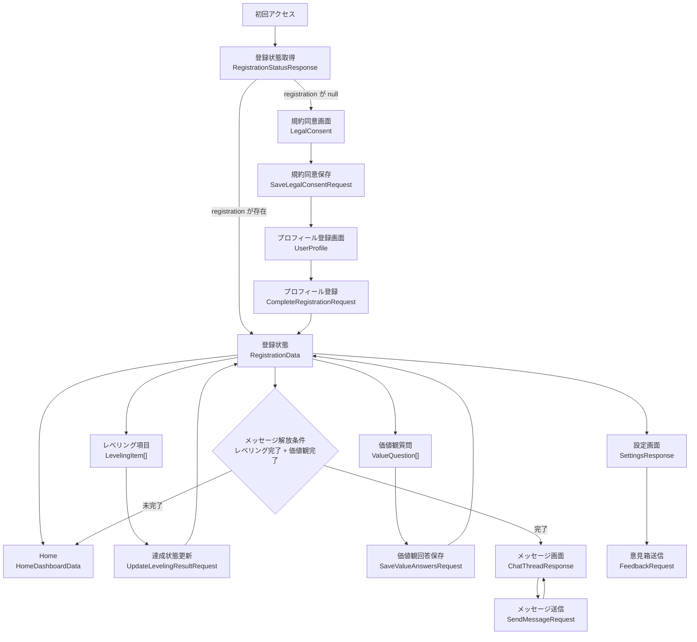
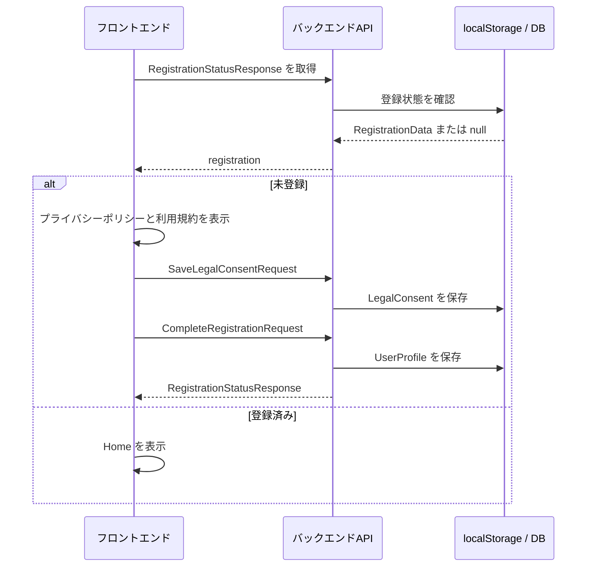
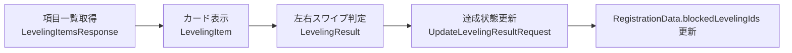
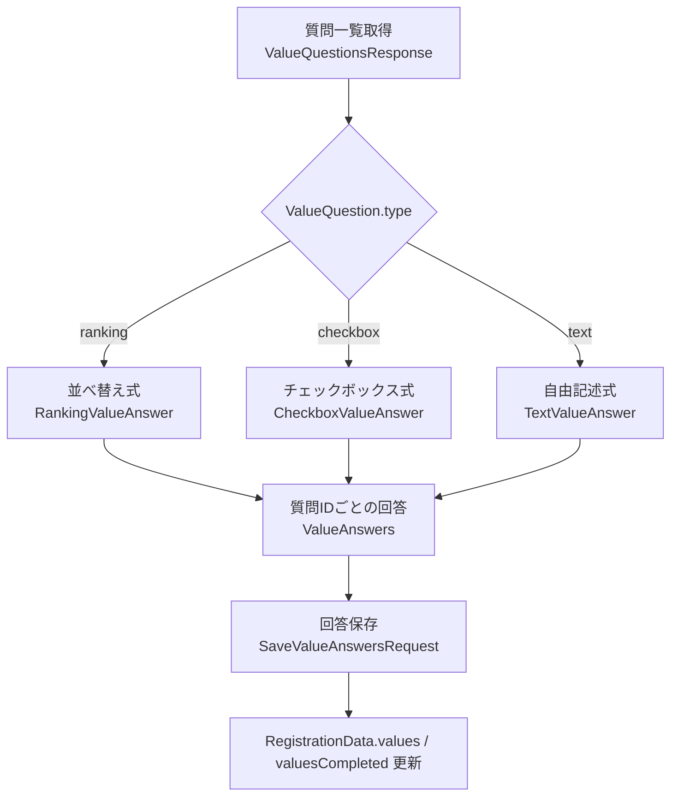
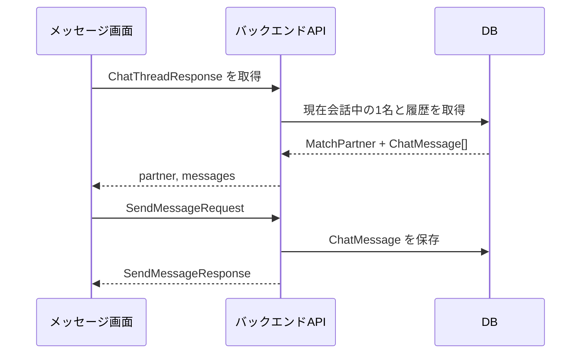
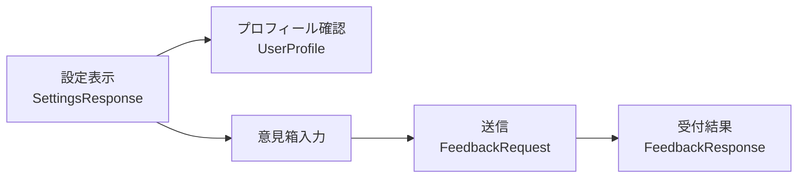

# データフロー図

## 目的

`src/types/api.ts` に定義した TypeScript 型を基に、現在のフロントエンドで扱うデータの流れを整理します。

現状はダミーデータと `localStorage` で動作していますが、後日バックエンド API に置き換える時に、どの画面がどのデータを取得・送信するかを確認しやすくするための図です。

## 全体フロー

## 初回登録

初回登録で確定するのは `UserProfile` です。レベリングと価値観質問は、登録完了後に各タブで進めます。

## レベリング

`blockedLevelingIds` に残っている項目が未達成として扱われます。すべて解消されると、メッセージ解放条件の片方を満たします。

## 価値観質問

質問方式は `ValueQuestion` の union で分岐します。1つの質問に複数方式を混在させず、回答側も同じ `type` の `ValueAnswer` として保存します。

## メッセージ

本アプリでは同時に会話できる相手は1名だけです。メッセージ送信は、Enterではなく送信ボタン押下時だけ行います。

## 設定・意見箱

設定画面では登録済みプロフィールを表示し、意見箱から `FeedbackRequest` を送信します。

## バックエンド統合時の境界

- 登録状態、プロフィール、同意履歴はユーザー単位で永続化します。
- `LevelingItem` と `ValueQuestion` は、将来的に管理画面やDBから配信できる前提にします。
- メッセージは `MatchPartner` が1名である制約をAPI側でも保証します。
- フロントエンドは `ApiSuccessResponse<T>` と `ApiErrorResponse` を共通形として扱います。

## 関連ドキュメント

- `docs/INPUT_CACHE_STRATEGY.md`: ユーザー入力をキャッシュし、まとまりごとに一括送信する方針
