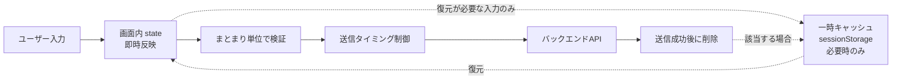
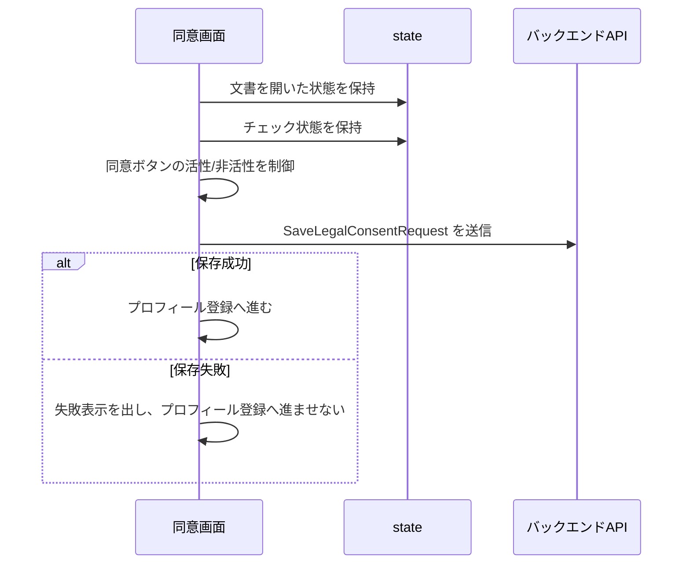
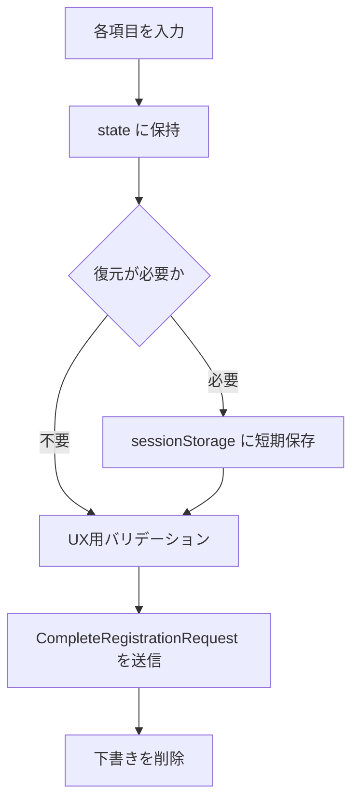
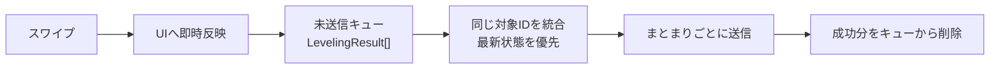
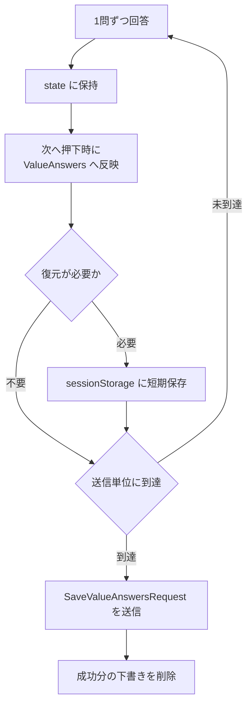
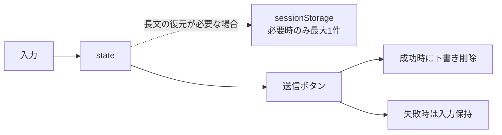

# 入力キャッシュ・一括送信設計

## 目的

ユーザー入力を `onChange` ごとにバックエンドへ送らず、フロントエンド側で入力中の状態、必要時の一時キャッシュ、送信タイミング、再送可能なUI状態を管理する方針を整理します。

狙いは以下です。

- バックエンドへのリクエスト回数を減らす
- 入力途中のUXを軽く保つ
- リロードや誤離脱で入力内容が失われるリスクを必要な範囲で下げる
- 個人情報や自由記述を必要以上にブラウザへ残さない
- 送信中、送信失敗、再送可能状態を画面で扱いやすくする

メッセージ送信はリアルタイム性が高く、今回の検討対象から除外します。

## 現状の入力一覧

| 入力 | 現在の画面 | 保存・送信候補 | 備考 |
| --- | --- | --- | --- |
| プライバシーポリシー閲覧 | 初回同意画面 | 送信対象外 | チェック可能にするためのUI状態です。 |
| 利用規約閲覧 | 初回同意画面 | 送信対象外 | チェック可能にするためのUI状態です。 |
| プライバシーポリシー同意 | 初回同意画面 | `LegalConsent` | 同意状態と表示中の文書IDまたは版数を送信します。 |
| 利用規約同意 | 初回同意画面 | `LegalConsent` | プライバシーポリシー同意と同じまとまりで扱います。 |
| 表示名 | プロフィール登録 | `UserProfile` | 個人情報登録の一部です。 |
| 年齢 | プロフィール登録 | `UserProfile` | 同上。 |
| 性別 | プロフィール登録 | `UserProfile` | 同上。 |
| 身長 | プロフィール登録 | `UserProfile` | 同上。 |
| 体重 | プロフィール登録 | `UserProfile` | 同上。 |
| エリア | プロフィール登録 | `UserProfile` | 同上。 |
| 沿線 | プロフィール登録 | `UserProfile` | 同上。 |
| レベルアップ項目の左右スワイプ | レベリング項目 | `LevelingResult[]` | 未送信キューに保持し、まとまりごとに送信します。 |
| 価値観質問: 並べ替え | 価値観質問 | `RankingValueAnswer` | 回答中はstate、次へ押下時に `ValueAnswers` へ反映します。 |
| 価値観質問: チェックボックス | 価値観質問 | `CheckboxValueAnswer` | 同上。 |
| 価値観質問: 自由記述 | 価値観質問 | `TextValueAnswer` | state中心で保持し、復元が必要な場合だけ短期キャッシュします。 |
| 意見箱 | 設定 | `FeedbackRequest` | 送信ボタン押下時に1件として送信します。 |

説明モーダルの開閉、フッタータブの遷移、登録状態リセットはUI操作ですが、通常のバックエンド保存対象ではありません。

## キャッシュの基本方針



入力中は画面内 state に即時反映します。バックエンドへは、入力欄の `onChange` ごとには送信しません。

`sessionStorage` は、リロードや誤離脱からの復元が必要な入力に限定して使います。すべての入力を一時キャッシュへ保存するわけではなく、入力グループごとに必要性を判断します。

`localStorage` は、今回の入力キャッシュ用途では原則使用しません。個人情報、自由記述、意見箱本文、価値観回答、認証情報を長期間ブラウザへ残さないためです。

送信に成功した場合は、該当する `sessionStorage` の下書きや未送信キューを削除します。送信に失敗した場合は入力内容や未送信キューを保持し、ユーザーが再送できる状態にします。

## 入力別の推奨キャッシュ

| 入力グループ | キャッシュ場所 | 送信タイミング | 備考 |
| --- | --- | --- | --- |
| 規約同意 | state | 「同意して進む」押下時 | 閲覧状態はUI制御用であり、送信しません。 |
| 個人情報登録 | state中心。複数画面に分かれる場合やリロード復元が必要な場合のみ `sessionStorage` | 登録ボタン押下時 | 単一画面で完結するなら `sessionStorage` は使いません。`localStorage` は使用しません。 |
| レベルアップ項目 | state + 未送信キュー | カード束完了時、一定件数到達時、または明示的な次へ/完了操作時 | タブ離脱直前送信は主手段ではなく補助扱いにします。 |
| 価値観質問 | state中心。自由記述や長い質問群で復元が必要な場合のみ `sessionStorage` | 質問数が少ない場合は全問完了時。質問数が多い場合はセクション単位または数問単位 | 全問完了時のみ送信に固定しません。`localStorage` は使用しません。 |
| 意見箱 | state。長文の誤離脱対策が必要な場合のみ `sessionStorage` | 送信ボタン押下時 | 下書き保存は最大1件程度に限定し、送信成功後に削除します。 |

## 実装デフォルト

現在の実装では、`src/cache/inputDrafts.ts` の `inputCacheDefaults` に以下のデフォルトを置いています。将来的に質問数や項目数が増える場合は、この値を設定ファイル化して調整できるようにします。

| 項目 | デフォルト | 意味 |
| --- | --- | --- |
| `profileDraftEnabled` | `false` | 個人情報登録は単一画面で完結するため、プロフィール入力の `sessionStorage` 下書き保存は行いません。 |
| `valuesDraftEnabled` | `true` | 価値観質問は回答途中の復元が必要になりやすいため、`sessionStorage` に短期保存します。 |
| `valuesFlushQuestionCount` | `5` | 価値観質問を数問単位で送る場合の目安です。現状の質問数は5問なので、全問完了時送信と同じ動きになります。 |
| `levelingFlushItemCount` | `3` | レベリング結果をまとめて送信する件数です。現状の項目数は3件なので、カード束完了時送信と同じ動きになります。 |
| `feedbackDraftEnabled` | `true` | 意見箱は長文の誤離脱対策として、必要時に下書きを短期保存します。 |
| `feedbackDraftLimit` | `1` | 意見箱の下書きは最大1件だけ保持します。 |

## 規約同意



フロントエンドは、文書を開いた状態、チェック状態、同意ボタンの活性/非活性を管理します。閲覧済みかどうかは、チェックボックスを有効化するためのUI状態です。

送信時は、同意した事実と、フロントエンドが表示しているプライバシーポリシー・利用規約の文書IDまたは版数を含めます。同意日時は信頼できる記録としてサーバー側で保存される前提にし、フロントエンドが確定値として扱わないようにします。

送信データのイメージ:

```ts
{
  consent: {
    privacyPolicyAgreed: true,
    privacyPolicyVersion: "privacy-2026-05",
    termsAgreed: true,
    termsVersion: "terms-2026-05"
  }
}
```

フロントエンド側では、送信中はボタンを無効化し、保存に失敗した場合は入力状態を残したまま再送可能にします。

## 個人情報登録

個人情報は入力途中でバックエンドへ送らず、登録ボタン押下時にまとめて送ります。入力途中は画面内 state に保持します。

単一画面で完結する現在のプロフィール登録では、原則として `sessionStorage` を使いません。複数画面に分かれる場合、入力項目が増える場合、またはリロード復元が必要な場合だけ `sessionStorage` に短期保存します。

推奨フロー:



`sessionStorage` に保存した場合は、登録成功時、ログアウト時、入力破棄時に削除します。`localStorage` には保存しません。

フロントエンドでは、必須項目、文字数、数値範囲、選択肢形式などのUX用バリデーションを行います。ただし、フロント側バリデーションはユーザー体験を整えるためのもので、セキュリティ上の最終検証ではありません。サーバー側での検証は別途必要です。

## レベルアップ項目

レベルアップ項目は、カードを1枚スワイプするたびに即時API送信すると、操作回数分だけリクエストが発生します。

フロントエンドでは、スワイプ直後にUI上の状態を即時反映し、`LevelingResult` を未送信キューに保持します。API送信は、カード束完了時、一定件数到達時、または次へ/完了操作時にまとめます。

タブ離脱直前やブラウザ復帰時の送信は、主保存タイミングではなく補助的な送信機会として扱います。



送信失敗時は未送信キューを残し、再送可能にします。同じカードに対する重複イベントがキュー内に入る場合は、同じ `card_id` または `itemId` の最新状態を優先して上書き・統合します。

再送を前提にしつつ、フロントエンド側でも重複送信を抑えます。サーバー側の冪等処理の詳細には踏み込まず、フロント側では「同じ対象IDの最新状態だけを送る」方針にします。

## 価値観質問

価値観質問は、並べ替え、チェックボックス、自由記述の3方式があります。いずれも回答中はstateに保持し、次へ押下時に1問分を `ValueAnswers` へ反映します。

送信タイミングは、質問量や離脱リスクに応じて決めます。質問数が少ない場合は全問完了時に一括送信で問題ありません。質問数が多い場合、自由記述が多い場合、または離脱リスクが高い場合は、セクション単位または数問単位で送信します。

| 方式 | 入力中の保持 | 確定タイミング | 送信タイミング |
| --- | --- | --- | --- |
| 並べ替え式 | state | 次へ押下時に1問分を `ValueAnswers` へ反映 | 全問、セクション、または数問単位 |
| チェックボックス式 | state | 次へ押下時に1問分を `ValueAnswers` へ反映 | 全問、セクション、または数問単位 |
| 自由記述式 | state中心。復元が必要な場合のみ `sessionStorage` | 次へ押下時に1問分を `ValueAnswers` へ反映 | 全問、セクション、または数問単位 |



自由記述は個人情報やセンシティブな内容を含む可能性があります。復元が必要な場合のみ `sessionStorage` に短期保存し、送信成功時、登録完了時、ログアウト時、入力破棄時に削除します。`localStorage` は使いません。

## 意見箱

意見箱は基本的にstateのみで扱い、送信ボタン押下時に `FeedbackRequest` を1件送信します。入力中の自動送信は行いません。

長文入力の誤離脱対策が必要な場合だけ、最大1件の下書きを `sessionStorage` に保存してよい方針にします。下書きは送信成功時、ログアウト時、入力破棄時に削除します。`localStorage` には保存しません。

送信失敗時は入力内容を消さず、再送できるようにします。



## 一括送信の単位

| API型 | フロントエンド側の送信単位 | 失敗時の扱い |
| --- | --- | --- |
| `SaveLegalConsentRequest` | 「同意して進む」押下時に1回 | 同意状態を保持し、プロフィール登録へ進ませず再送可能にする |
| `CompleteRegistrationRequest` | 登録ボタン押下時に1回 | 入力内容を保持し、再送可能にする |
| `UpdateLevelingResultRequest` | 複数件をまとめて送れるAPIがある場合はバッチ送信。ない場合はAPI仕様に合わせる | 未送信キューを保持し、成功したデータは未送信状態から削除する |
| `SaveValueAnswersRequest` | 質問量に応じて全問、セクション、または数問単位 | 回答内容を保持し、成功したデータは未送信状態から削除する |
| `FeedbackRequest` | 送信ボタン押下時に1件 | 入力内容を保持し、再送可能にする |

フロントエンドは、複数件をまとめて送れるAPIがある場合はバッチ送信を利用します。APIが1件単位の場合は、その仕様に合わせつつ、送信タイミングと未送信キューの管理でリクエスト回数を抑えます。

部分成功レスポンスの詳細設計はバックエンド側の仕様に依存します。フロントエンドでは、成功したデータを未送信状態から削除し、失敗または未確定のデータを再送可能な状態で残します。

## セキュリティ方針

- `localStorage` は、今回の入力キャッシュ用途では原則使用しません。
- `sessionStorage` を使う場合も、保存対象と保存期間を最小化します。
- 個人情報、自由記述、意見箱本文、価値観回答、認証情報は `localStorage` に保存しません。
- `sessionStorage` に保存した下書きは、送信成功時、ログアウト時、登録完了時、入力破棄時に削除します。
- キャッシュにはアクセストークン、リフレッシュトークン、Cookie値などの認証情報を含めません。
- フロント側バリデーションはUX向上のためであり、セキュリティ上の最終検証ではありません。
- バックエンド送信前にも、フロント側で文字数、選択数、必須項目、形式の検証を行います。

## UX方針

- 入力中はAPI待ちを発生させず、画面内 state で即時反映します。
- 送信中はボタンを `disabled` にし、二重送信を防ぎます。
- 送信中であることが分かる表示を出します。
- 保存失敗時は入力内容を消しません。
- 保存失敗時は再送ボタン、または再試行可能な導線を用意します。
- レベリングや価値観質問は、ユーザーの操作テンポを優先し、API送信はまとまりごとに行います。
- キャッシュから復元した場合は、必要に応じて「入力途中の内容を復元しました」程度の控えめな表示を検討します。
- 画面遷移前に未保存データがある場合は、必要に応じて確認を出します。
- 送信状態は `idle / dirty / saving / saved / error` のような状態で管理できるようにします。

## 実装時の推奨構成

将来的には、画面コンポーネントから直接 storage や API を触らず、以下のように分けると管理しやすくなります。

```text
src/
  api/
    registration.ts
    leveling.ts
    values.ts
    feedback.ts
  cache/
    inputDrafts.ts
    pendingQueue.ts
  types/
    api.ts
```

`cache/inputDrafts.ts` は、`sessionStorage` を使う下書き保存・復元・削除を担当します。`localStorage` は原則使いません。

`cache/pendingQueue.ts` は、レベリングなどの未送信キューを管理します。同じ対象IDの重複を統合し、最新状態を保持します。

`api/*.ts` は、API呼び出しのみを担当します。コンポーネントから直接 `fetch` しない構成を推奨します。

`types/api.ts` は、リクエスト・レスポンス型を集約します。

画面コンポーネントは、state管理、UI制御、送信状態の表示を中心にし、storageやAPIの詳細を直接持たない方針にします。

## フロントエンド担当範囲

フロントエンドで担当すること:

- 入力中のstate管理
- 必要時の `sessionStorage` 保存・復元・削除
- 未送信キュー管理
- 送信タイミング制御
- 送信中・失敗・再送のUI制御
- フロント側バリデーション

フロントエンドだけでは完結しないこと:

- サーバー側の最終バリデーション
- 同意日時の信頼できる記録
- DB保存形式
- APIの部分成功レスポンス設計
- サーバー側の冪等処理
